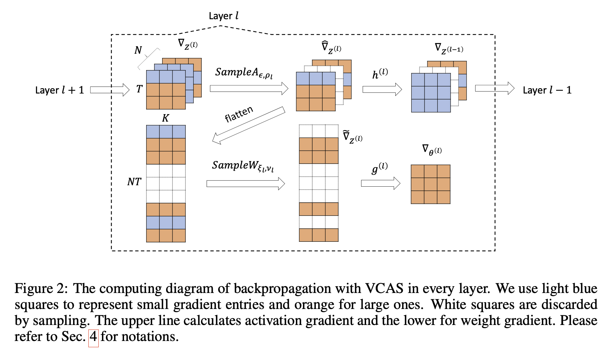

<h2 align=center>VCAS: variance-controlled adaptive sampling</h1>

Official implementation of the paper: *[Efficient Backpropagation with Variance Controlled Adaptive Sampling](https://arxiv.org/pdf/2402.17227.pdf)* accepted by **ICLR 2024**.

### Abstract

VCAS is an efficient unbiased sampling method to accelerate back propagation (BP). It can achieve an up to **73.87%** FLOPs reduction of BP with lossless performance under theoretical guarantee. [Example Results](https://wandb.ai/thuwzt/vcas).



### Installation
**Requirements**: Python >= 3.7 + CUDA >= 11.0 + torch >= 1.12.0 + transformers >= 4.21.0

To install VCAS only, run the following:

```bash
pip install -v -e .
```

To further run the examples, run the following :

```bash
conda create -n vcas python=3.9
conda activate vcas
pip install -r requirements.txt # install dependencies
pip install -v -e . # install vcas
```

### Quick Start


There are four steps to use VCAS in your project:

1. Add `VcasSampleArguments` to the argument parser
2. Initialize `VcasSampleScheme` with `VcasSampleArguments`
3. Process the original model with `VcasModelProcessor`
4. Substitute the original huggingface `Trainer` with `VcasTrainer`

```python
from vcas import VcasSampleArguments, VcasSampleScheme, VcasModelProcessor, VcasTrainer

......

# CHANGES #1: Add VcasSampleArguments to the argument parser 
parser = HfArgumentParser((..., VcasSampleArguments))
..., sample_args = parser.parse_args_into_dataclasses()

# CHANGES #2: Initialize VcasSampleScheme with VcasSampleArguments
sample_scheme = VcasSampleScheme(sample_args)

# CHANGES #3: Process the original model with VcasModelProcessor
model = ...
act_sampling_repetend = ... # basic block of the model, after which VCAS insert activation sampler, eg. BertLayer in BertModel
processor = VcasModelProcessor(model, act_sampling_repetend, sample_scheme)
processor.process()

# CHANGES #4: Substitute the original huggingface Trainer with VcasTrainer
trainer = VcasTrainer(..., sample_scheme=sample_scheme)

......
```

For research studies, you can refer to the sampling layers in [vcas/layers](vcas/layers) and the adaptive sampling strategy in [vcas/vcas_trainer.py](vcas/vcas_trainer.py). Help yourself to integrate them into your model and pipeline directly.

### Example Usage

We provide an example of BERT fintuning on SST-2 dataset in [examples/run_glue.py](examples/run_glue.py). Run the following:

```bash
cd examples
bash run.sh
```

We record the running results above and compare it with the exact training baseline (run with `bash run_baseline.sh`) on NVIDIA 2080Ti. Check the results through [https://wandb.ai/thuwzt/vcas](https://wandb.ai/thuwzt/vcas).

Help yourself to compare [examples/run_glue.py](examples/run_glue.py) with [examples/run_glue_baseline.py](examples/run_glue_baseline.py) to see the modifications and change `model_name_or_path` and `task_name` in [examples/run.sh](examples/run.sh) to try other models and datasets using VCAS.

### Modifying Sampling Hyperparameters

VCAS provides a set of hyperparameters which are proven to be insensitive to the performance. However, you can still modify them to fit your specific task. Please check [vcas/sample_args.py](vcas/sample_args.py) for more details.

The main hyperparameters are:
- `act_var_tau`: The acceptable ratio of the activation sampling variance to the SGD variance (default: 0.025), higher value means more aggressive sampling.
- `w_var_tau`: The acceptable ratio of the weight sampling variance to the SGD variance (default: 0.025), higher value means more aggressive sampling.
- `cal_var_freq`: The frequency to calculate variance (default: 100), higher value brings less overhead but less sufficient adaptation. We recommend to keep it at least 1/50 of total training steps for thorough adaptation.